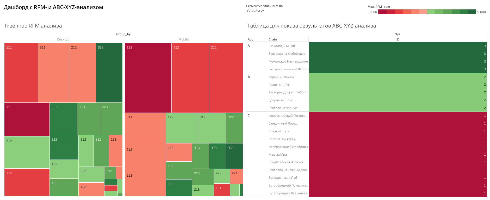

# 3. Analysis of Growth Points

## Table of Contents
1. [User Journey Analysis](#user-journey-analysis)
2. [RFM and ABC-XYZ Analysis](#rfm-and-abc-xyz-analysis)
3. [SQL Pipeline](#sql-pipeline)
   - [Weekly Revenue by Chain](#weekly-revenue-by-chain)
   - [Partner Variation Metrics](#partner-variation-metrics)
   - [ABC-XYZ Grouping](#abc-xyz-grouping)
4. [Dashboard](#dashboard)
5. [Conclusions](#conclusions)
   - [Improving the User Journey](#improving-the-user-journey)
   - [Customer Loyalty](#customer-loyalty)
   - [Partner Network Strategy](#partner-network-strategy)

---

## User Journey Analysis

| Question                                                          | Purpose                                                      |
|-------------------------------------------------------------------|--------------------------------------------------------------|
| How many sessions do users typically generate?                    | Understand typical engagement levels                         |
| During which session does the first purchase usually occur?       | Analyze purchase timing and differences across user segments |
| What is the most typical user path during the first session?      | Identify common first-session actions                        |
| Do event sequences vary across platforms, cities, and sources?    | Segment behavior patterns                                    |
| What are the key steps from entry to first purchase?              | Map critical touchpoints                                     |
| What bottlenecks exist in this journey?                           | Detect friction points and recommend UX improvements         |
| Do user journeys differ by platform, city, or acquisition source? | Understand variations in user experience by segmentation     |

---

## RFM and ABC-XYZ Analysis

| Question                                                                                           | Purpose                                                                                   |
|----------------------------------------------------------------------------------------------------|-------------------------------------------------------------------------------------------|
| What are the three largest RFM segments by platform, city, and source?                           | Identify dominant customer clusters                                                      |
| Which customer segments are healthiest or most problematic?                                      | Assess retention and profitability                                                       |
| How are partner networks distributed across ABC-XYZ segments?                                     | Classify partner value and stability                                                      |
| Why shouldn't segmentation be applied to ABC-XYZ analysis?                                        | Prevent misinterpretation of inventory-focused analytics                                  |

---

## SQL Pipeline

### Weekly Revenue by Chain
Calculate weekly revenue for each partner chain.

```sql
WITH daily_revenue AS (
    -- Calculate weekly revenue per restaurant chain
    SELECT p.chain,
           date_trunc('week', log_date) AS log_week,
           SUM(revenue) AS revenue
    FROM module3_analytics_events e
    LEFT JOIN module3_partners p ON p.rest_id = e.rest_id
    WHERE event = 'order'
    GROUP BY p.chain, date_trunc('week', log_date)
)
```

### Partner Variation Metrics
Compute revenue variation metrics.

```sql
,partners AS (
    -- Calculate revenue standard deviation and coefficient of variation
    SELECT chain,
           SUM(revenue) AS revenue,
           STDDEV(revenue) AS std,
           STDDEV(revenue) / AVG(revenue) AS var_coeff
    FROM daily_revenue
    GROUP BY chain
)
```

### ABC-XYZ Grouping
Assign each partner to ABC and XYZ groups.

```sql
,abc_xyz AS (
    -- Calculate cumulative revenue share and assign ABC/XYZ segments
    SELECT chain,
           revenue,
           SUM(revenue) OVER (ORDER BY revenue DESC) AS cumulative_revenue,
           SUM(revenue) OVER () AS tot_rev,
           SUM(revenue) OVER (ORDER BY revenue DESC) / SUM(revenue) OVER () AS perc,
           std,
           var_coeff
    FROM partners
    ORDER BY revenue DESC
)

SELECT chain,
       CASE 
           WHEN perc <= 0.8 THEN 'A'
           WHEN perc <= 0.95 THEN 'B'
           ELSE 'C'
       END AS abc,
       CASE 
           WHEN var_coeff <= 0.1 THEN 'X'
           WHEN var_coeff <= 0.3 THEN 'Y'
           ELSE 'Z'
       END AS xyz
FROM abc_xyz;
```

---

## Dashboard

[View Tableau Dashboard](https://public.tableau.com/app/profile/svetlana.bogomaz/viz/Userjourney_17244414208700/RFM-ABC-XYZ-?publish=yes)



---

## Conclusions

### Improving the User Journey
- Most users purchase during their first session.
- The main bottleneck is phone number verification — the registration interface should be improved, especially for mobile.
- Adding items to cart also causes significant drop-off — UX testing is recommended to find friction points.

### Customer Loyalty
- The biggest issue is low repeat purchases, particularly in segments 111, 112, 211, and 311.
- Loyalty programs and cumulative discounts may improve frequency and average check.
- Targeted campaigns in cities like Novosibirsk (e.g., segment 312) may unlock additional value.

### Partner Network Strategy
- Stabilizing demand for restaurants like Gastronomic Storm and Gourmet Delight could boost revenue.
- Consider terminating underperformers in Group C, such as Sandwich Universe, Mamma Mia, etc.
- Prioritize high-performing chains and enhance the partner mix for sustainability.
