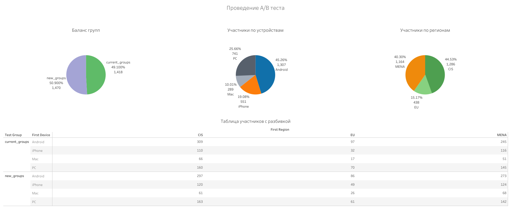

# 4. A/B Test of Marketplace "Everything.Equipment"

## Table of Contents
1. [Context and Objective](#context-and-objective)
2. [Hypothesis and Metrics](#hypothesis-and-metrics)
3. [Questions](#questions)
4. [SQL Pipeline](#sql-pipeline)
   - [User Profile + Purchases (Historic)](#user-profile--purchases-historic)
   - [Test Group Overlap Check](#test-group-overlap-check)
   - [User Profile + Purchases (Test)](#user-profile--purchases-test)
5. [Dashboard](#dashboard)
6. [Conclusions and Recommendations](#conclusions-and-recommendations)

---

## Context and Objective

**Context:** The marketplace **"Vse.tekhnika"** introduced a new category for **gaming laptops**, previously grouped with other computers. Before full deployment, an **A/B test** was run to validate the effect of this change.

**Objective:** Assess whether creating a dedicated category improves visibility and sales of gaming laptops.

---

## Hypothesis and Metrics

**Hypothesis:**
- Demand for gaming laptops is underestimated due to difficulty locating them in the catalog.

**Test Metrics:**
- **Conversion rate** will double.
- **Average order value (AOV)** will remain unchanged.

---

## Questions

| Question                                                        | Purpose                                       |
|-----------------------------------------------------------------|-----------------------------------------------|
| Are control and test groups balanced in size?                  | Ensure test validity                          |
| Did the test group have a significantly higher conversion rate?| Measure hypothesis success                    |
| Was there a change in average order value (AOV)?               | Assess quality of revenue                     |
| Were statistical tests used to validate results?               | Evaluate reliability of findings              |
| What business actions are recommended?                         | Guide future implementation                   |

---

## SQL Pipeline

### User Profile + Purchases (Historic)
Get user attributes and purchase summary from historical dataset.

```sql
WITH profiles AS (
    -- Create user profile from historic sessions
    SELECT DISTINCT user_id,
           MIN(install_date) OVER (PARTITION BY user_id) AS install_date,
           MAX(registration_flag) OVER (PARTITION BY user_id) AS registration_flag,
           FIRST_VALUE(region) OVER (PARTITION BY user_id ORDER BY session_start_ts) AS first_region,
           FIRST_VALUE(device) OVER (PARTITION BY user_id ORDER BY session_start_ts) AS first_device
    FROM sessions_project_history
    WHERE install_date BETWEEN '2020-08-11' AND '2020-09-10'
),
orders AS (
    -- Get transactions and revenue
    SELECT user_id,
           COUNT(purchases_number) AS transactions,
           SUM(price) AS revenue
    FROM purchases_project_history
    WHERE category = 'computer_equipments'
    GROUP BY user_id
)
-- Combine profiles and orders
SELECT p.user_id, p.install_date, o.transactions, o.revenue
FROM profiles p
LEFT JOIN orders o ON o.user_id = p.user_id;
```

### Test Group Overlap Check
Verify that users appear in only one test group.

```sql
WITH profiles AS (
    -- Create user profile for partial test group
    SELECT DISTINCT user_id,
           MIN(install_date) OVER (PARTITION BY user_id) AS install_date,
           MAX(registration_flag) OVER (PARTITION BY user_id) AS registration_flag,
           FIRST_VALUE(region) OVER (PARTITION BY user_id ORDER BY session_start_ts) AS first_region,
           FIRST_VALUE(device) OVER (PARTITION BY user_id ORDER BY session_start_ts) AS first_device,
           FIRST_VALUE(test_name) OVER (PARTITION BY user_id ORDER BY session_start_ts) AS test_name,
           test_group
    FROM sessions_project_test_part
    WHERE install_date BETWEEN '2020-10-14' AND '2020-10-14'
)
-- Count users assigned to multiple groups
SELECT user_id, COUNT(DISTINCT test_group) AS in_groups
FROM profiles
WHERE test_name = 'gaming_laptops_test'
GROUP BY user_id
HAVING COUNT(DISTINCT test_group) > 1;
```

### User Profile + Purchases (Test)
Assemble test user data and revenue.

```sql
WITH profiles AS (
    -- Create user profile for test dataset
    SELECT DISTINCT user_id,
           MIN(install_date) OVER (PARTITION BY user_id) AS install_date,
           MAX(registration_flag) OVER (PARTITION BY user_id) AS registration_flag,
           FIRST_VALUE(region) OVER (PARTITION BY user_id ORDER BY session_start_ts) AS first_region,
           FIRST_VALUE(device) OVER (PARTITION BY user_id ORDER BY session_start_ts) AS first_device,
           FIRST_VALUE(test_name) OVER (PARTITION BY user_id ORDER BY session_start_ts) AS test_name,
           FIRST_VALUE(test_group) OVER (PARTITION BY user_id ORDER BY session_start_ts) AS test_group
    FROM sessions_project_test
    WHERE install_date BETWEEN '2020-10-14' AND '2020-10-20'
),
orders AS (
    -- Get transactions and revenue
    SELECT user_id,
           COUNT(purchases_number) AS transactions,
           SUM(price) AS revenue
    FROM purchases_project_test
    WHERE category = 'computer_equipments'
    GROUP BY user_id
)
-- Combine test profiles and purchases
SELECT p.user_id, p.install_date, p.test_group, o.transactions, o.revenue
FROM profiles p
LEFT JOIN orders o ON o.user_id = p.user_id
WHERE test_name = 'gaming_laptops_test';
```

---

## Dashboard

[View Tableau Dashboard](https://public.tableau.com/app/profile/svetlana.bogomaz/viz/ABtest_17260813740980/Rev)





---

## Conclusions and Recommendations

### A/B Test Summary
- Test and control groups were evenly distributed: **15,256 control**, **15,078 test**.
- **Conversion rate** improved: **1.11%** (test) vs **0.52%** (control).
- **AOV** was **580 RUB higher** in the control group, due to extreme values in the test group.

### Statistical Results
- **Z-test for conversion rate** → p-value = 0.00000 → statistically significant improvement.
- **T-test for AOV** → p-value = 0.26938 → no significant difference.
- **Mann-Whitney test** → p-value = 0.01016 → significant difference in distribution.

### Business Interpretation
- Hypothesis partially validated: conversion improved, but AOV did not.
- Test group benefited from easier product discovery.
- Lower AOV possibly due to:
  - Cheaper items in the category.
  - Younger, lower-income audience.
  - Fewer high-value accessory purchases.

### Recommendations
1. Reevaluate gaming laptop category assortment to balance pricing.
2. Launch loyalty programs to increase future spending.
3. Run targeted bundles or promotions (e.g., accessories with laptops).
